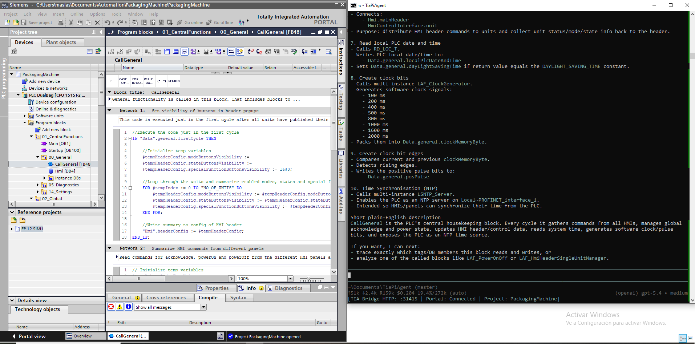

#  Pi TIA Agent a Pi Agent extension

**The ultimate bridge between AI and Industrial Automation.**

This project transforms your TIA Portal engineering experience by extending the **Pi Coding Agent** to the world of Siemens automation. It allows an AI agent to "see," "interact," and "modify" your TIA Portal projects, PLC code, HMI screens, and hardware configurations in real time using the Siemens TIA Portal Openness API.

---

## 🤖 What is the Pi Coding Agent?

The [Pi Coding Agent](https://shittycodingagent.ai/) is an advanced AI-powered developer harness designed to operate directly within your workspace. Unlike static chat interfaces, Pi can:
- **Read and Write Files**: It understands your entire codebase context.
- **Execute Commands**: It runs builds, scripts, and automation tools.
- **Self-Correct**: It observes the results of its actions and iterates until the task is complete.
- **YOLO Mode**: By default, the agent operates with a "get things done" philosophy, executing complex workflows with speed and autonomy.

We have extended this philosophy to TIA Portal, creating a seamless link between high-level AI reasoning and low-level industrial engineering. 
check out : https://github.com/badlogic/pi-mono/tree/main/packages/coding-agent

---

## 🌟 Key Features

- **🤖 AI-Driven PLC Programming**: Ask the agent to generate SCL blocks, refactor logic, or explain complex networks.
- **🔌 Seamless UI Integration**: Right-click any block or tag table directly in TIA Portal to trigger AI reviews, explanations, or custom prompts via the **Pi Agent Add-in**.
- **🛠️ Automated Hardware Management**: Programmatically discover, add, and configure PLC modules, ET200 stations, and drives.
- **📊 HMI & Tag Synchronization**: Automatically manage HMI tags, connections, and screen items.
- **⚡ Smart Import/Export**: Intelligent handling of block formats (XML vs. Document) based on language and protection status.
- **🧪 Testing & Validation**: Create disposable test blocks, compile them, and verify logic without manual clicks.

---

## 🧠 Agent Intelligence (.pi folder)

This repository is "agent-ready" out of the box. The `.pi` folder contains the configurations that turn a standard Pi Coding Agent into a TIA Portal Expert.
drop .pi folder on your working folder and run pi command 
- **Extensions (`.pi/extensions`)**: Includes `tiabridge.ts`, which registers the `tiabridge` tool. This allows the agent to send pipe-separated commands directly to the `TiaLocalBridge.exe`.
- **Skills (`.pi/skills`)**: The `tia-portal-agent` skill provides the agent with structured workflows for discovery, export, import, and testing. It ensures the agent follows best practices when interacting with your PLC project.
- **Prompts (`.pi/prompts`)**: Specialized system prompts (e.g., `tia-plc-blocks.md`) that teach the agent how to interpret TIA Openness XML and document formats, as well as how to handle device references.

When you start the Pi Coding Agent in this directory, it automatically loads these capabilities, making it immediately aware of your TIA environment without any additional setup.

---

The system follows the Pi Coding Agent's extension model, consisting of two main components:

### 1. [TiaLocalBridge](./TiaLocalBridge)
A high-performance C# command bridge utilizing the **Siemens Openness API**. It acts as the "hands" of the AI agent.
complete source code avalaible , by default tia agent will try to work with birdge if asked can extend the bridge with not implemented functionailities 

### 2. [TiaPiAddin](./TiaPiAddin)
A native TIA Portal Add-in providing a direct "hotline" from the Engineering UI to the Pi Agent.

---

## 🚀 Getting Started

### Tia Agent works with frontier models such as (openai 5.4 , gemini 5.1-pro) tested should work on other top tier models 

### Prerequisites
- **TIA Portal V20** (Current tested version).
- **Siemens Openness** installed and configured.
- **.NET Framework 4.8** (for the bridge and add-in).
- **Pi Coding Agent** installed and running.
- **Install Pi coding agent and it will help you set up 

### Installation
1.  **Build the Bridge**: Compile the `TiaLocalBridge` solution.
2.  **Install the Add-in**: Copy the `.addin` file from `TiaPiAddin/bin/Debug/net48/` to your TIA Portal `AddIns` folder and activate it.
3.  **Start the Agent**: Run the Pi Coding Agent in your workspace. It will automatically detect the extension and wait for commands or Add-in triggers.

### TIA Openness Configuration
To allow the Bridge to interact with TIA Portal, you must ensure Openness is correctly configured:
- **Enable Openness**: Ensure "TIA Portal Openness" was selected during the TIA Portal installation (under Options).
- **User Group Membership**: You must add your Windows user account to the local **"Siemens TIA Openness"** user group.
    1. Open **Computer Management** (`compmgmt.msc`).
    2. Navigate to **Local Users and Groups** > **Groups**.
    3. Double-click the **Siemens TIA Openness** group.
    4. Add your current user account to the list.
    5. **Log off and log back on** for the changes to take effect.
- **Firewall/Permissions**: The first time the bridge runs, TIA Portal may show a security prompt. You should select "Yes to all" to allow the connection.

---

## ⚠️ Disclaimer & Status

- **Experimental**: This project is currently in **active development and testing**. 
- **Open Source**: We believe in open collaboration for the future of industrial automation.
- **YOLO Default**: Following the Pi Coding Agent philosophy, this tool defaults to high-autonomy operation not only on tia portal also on your complete system . (please use a VM):
  https://encrypted-tbn0.gstatic.com/images?q=tbn:ANd9GcQ7KwG7LUubAmwjC2ENRnPAGtVuXPB6ibJ9dUmlw81VcWOJrLLgpHVnyVtVMXz3HTs&s&ec=121638500
- **Safety First**: **NEVER** use this agent directly on a live production PLC. Always validate AI-generated code in a simulated environment (PLCSIM) and perform thorough manual reviews before deployment.
- **Almost 90% of the code on tis repo is AI generated with human supervision**: if you re not confortable with that 

---

## 📂 Repository Structure

- `TiaLocalBridge/`: The core Openness automation engine.
- `TiaPiAddin/`: The TIA Portal UI extension.
- `examples/`: Practical tutorials and example workflows.
- `TiaLocalBridge/scripts/`: Useful PowerShell utilities for testing and inspection.

---

## 🙌 Credits

Built for the **Awesome Pi Coding Agent**. Elevate your automation engineering to the next level.
